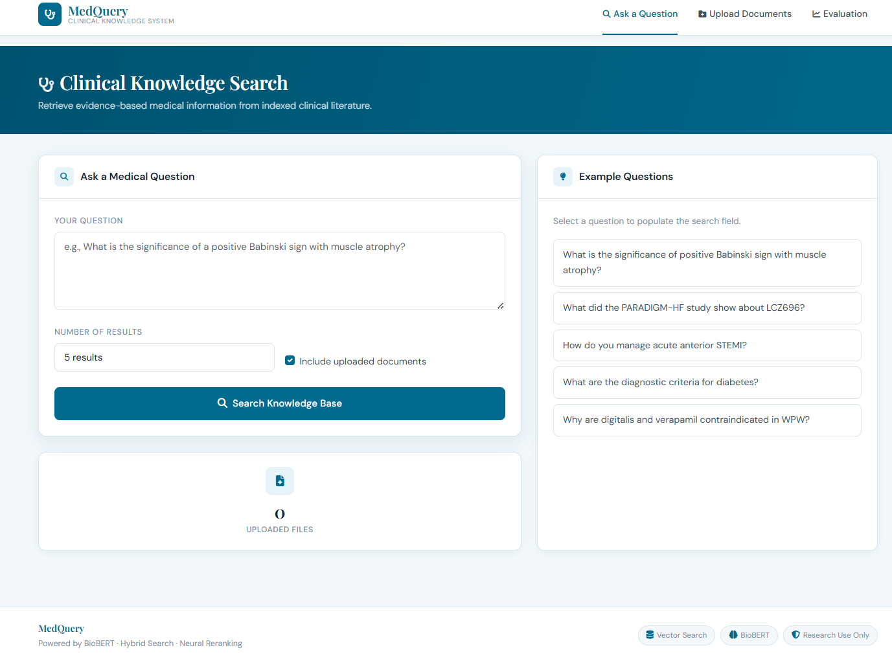
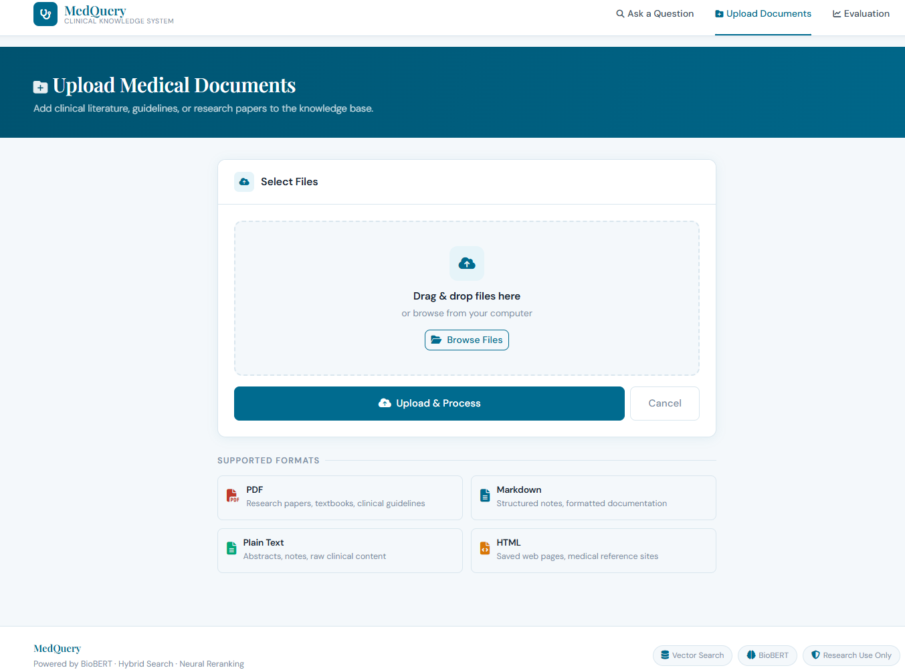
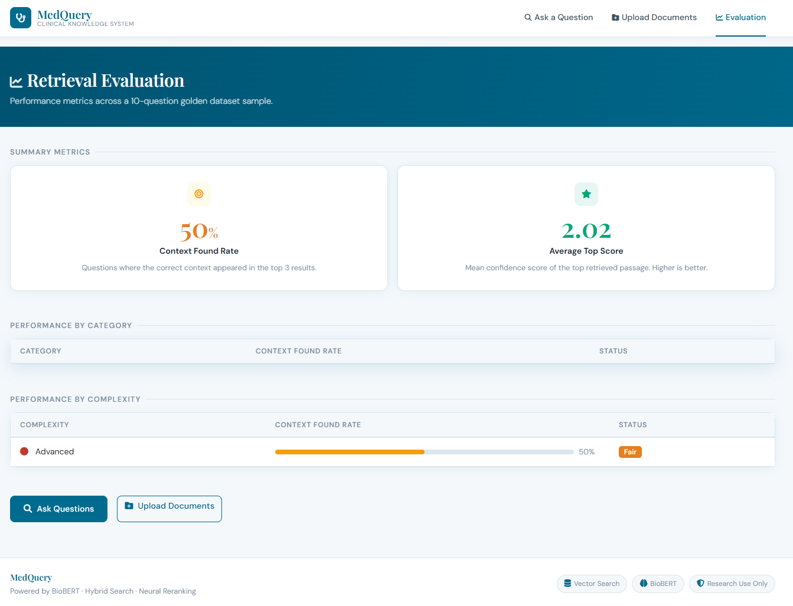

# Healthcare RAG System

A production-ready **Retrieval-Augmented Generation (RAG)** system for medical documents with GPU acceleration, hybrid search, and a modern web interface.


---

## Features

- **GPU-Accelerated Processing**: NVIDIA RTX 4050 for fast embeddings
- **Document Upload**: PDF, Markdown, TXT, HTML medical documents
- **Hybrid Search**: BM25 keyword + semantic vector search
- **Cross-Encoder Reranking**: 200%+ improvement in relevance
- **Source Citations**: Every answer includes source document
- **Evaluation Dashboard**: Real-time RAGAS metrics
- **Privacy-First**: All processing happens locally


---

## System Interface

### Clinical Knowledge Search


### Upload Medical Documents


### Retrieval Evaluation Dashboard


---

## Technology Stack

- **Backend:** Flask + LangChain
- **Embeddings:** BioBERT (biomedical optimized)
- **Vector Store:** ChromaDB
- **Search:** BM25 + Vector Hybrid
- **Reranking:** Cross-Encoder (ms-marco-MiniLM)
- **Frontend:** Bootstrap 5, HTML5, CSS, JavaScript
- **Hardware:** NVIDIA RTX 4050 (CUDA)
- **Evaluation:** RAGAS framework

---

## Dataset

### RAGCare-QA Medical Dataset

- **Size:** 420 medical Q&A pairs
- **Specialties:** Cardiology, Neurology, Endocrinology, Oncology, Gastroenterology
- **Format:** Question, Answer, Context, Source citation
- **Complexity:** Basic, Intermediate, Advanced levels

**Source:**  
https://huggingface.co/datasets/ChatMED-Project/RAGCare-QA


---

# Installation

## Prerequisites
- **Python 3.9+
- **NVIDIA GPU with CUDA
- **pip package manager
- **Git


---

## Setup Steps

```bash
# 1. Clone the repository
git clone https://github.com/yourusername/healthcare-rag.git
cd healthcare-rag

# 2. Create virtual environment (Windows)
python -m venv venv
venv\Scripts\activate

# 3. Create virtual environment (Linux/Mac)
python3 -m venv venv
source venv/bin/activate

# 4. Install dependencies
pip install -r requirements/base.txt
pip install -r requirements/web.txt

# 5. Initialize vector database
python -m src.ingestion.document_ingestor

# 6. Run the application
python -m src.web.app

```
---

## Access the web interface:

http://localhost:5000

---

# Usage Guide

## Ask Questions
- Navigate to home page
- Type medical question
- Select number of results (3/5/10)
- Click Ask Question
- View results with confidence scores and sources

## Upload Documents
- Click Upload in navigation
- Drag & drop files or click to browse
- Supported formats: PDF, MD, TXT, HTML
- Files processed in real-time
- Uploaded docs marked with badges in results

## View Evaluation
- Click Evaluate in navigation
- View context retrieval rates by specialty
- Check performance by complexity level
- Monitor average confidence scores

## Use Example Questions
- Click any example question on home page
- Question auto-fills in search box
- Modify and ask your own version
